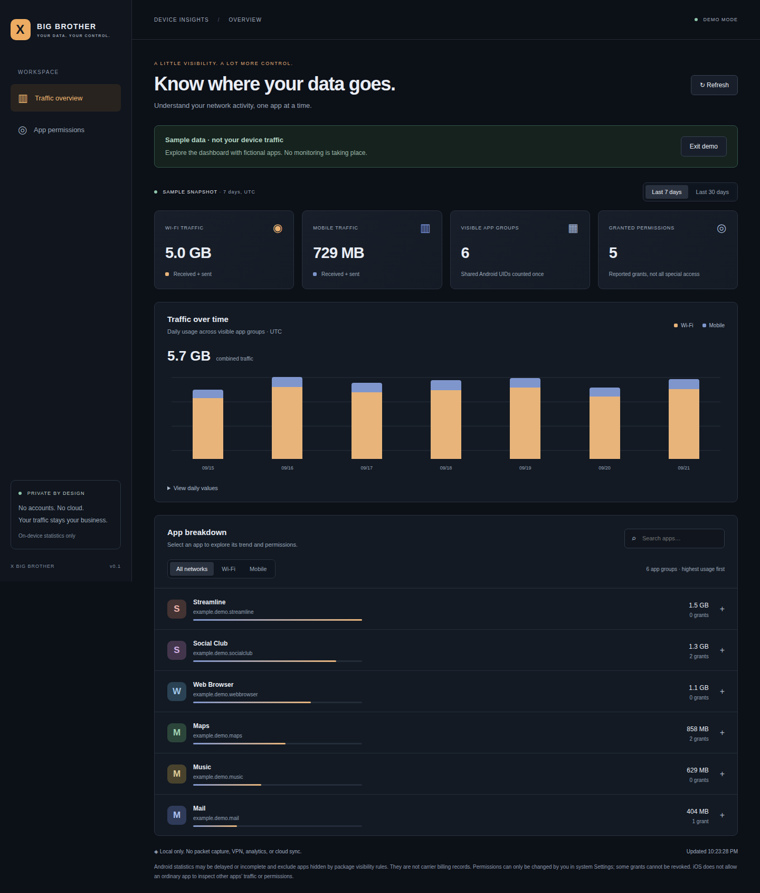

# X Big Brother

**Your data. Your control.** A local-only Android and iOS app for understanding network usage and reviewing app permissions, built with React, TypeScript, and Capacitor. The same dashboard also runs as a static web build, with browser limitations stated up front.



> Playwright capture of **fictional demo data**, not a real device.
> More views: [mobile traffic](docs/screenshots/mobile-traffic.png) · [desktop permissions](docs/screenshots/desktop-permissions.png) · [mobile permissions](docs/screenshots/mobile-permissions.png)

## Quick start

Requires Node.js 22.13+ and npm.

```sh
npm ci
npm run dev
```

The browser opens an honest unavailable-data state, because a web page cannot read another app’s traffic. Select **Explore demo** to walk through the dashboard with clearly labeled fictional apps. No accounts, remote fonts, external APIs, or analytics are involved, and demo mode is never persisted.

| I want to… | Go to |
| --- | --- |
| Learn the dashboard controls | [Using the dashboard](#using-the-dashboard) |
| Know what the app can and cannot measure | [What it can actually do](#what-it-can-actually-do) |
| Understand accuracy caveats | [Coverage and accuracy](#coverage-and-accuracy) |
| Build the static web dashboard | [Web](#web) |
| Build and run the Android app | [Android](#android) |
| Build and run the iOS app | [iOS](#ios) |
| Run checks locally | [Tests and CI](#tests-and-ci) |
| Cut a release | [Publish packages and release](#publish-packages-and-release) |
| Report a vulnerability | [SECURITY.md](SECURITY.md) |

## Using the dashboard

- **Traffic overview** and **App permissions** are separate workspace views; the header always states whether you are seeing on-device, iOS-limited, browser-preview, or demo data.
- **Last 7 / Last 30 days** and the **All networks / Wi-Fi / Mobile** filters apply to the chart, the summary cards, and the app list together.
- Selecting an app narrows the chart to that app group and reveals its permission list; **Show all apps** returns to the combined view.
- The app list is sorted by highest usage, shows each app group’s share as a bar, and can be filtered with the search box (name or package ID) and cleared with the × button.
- **View daily values** exposes the same chart data as an accessible table, and **Coverage & reporting limitations** lists anything the OS could not report.
- Failed reads show an alert with a **Try again** action instead of stale or zeroed numbers.
- Keyboard users get a **Skip to dashboard** link, visible focus rings, and a polite live region that announces refreshes.

## What it can actually do

| Capability | Android | iOS |
| --- | --- | --- |
| Wi-Fi and mobile received + sent totals by app | OS-reported statistics for visible launcher-app UIDs, after you grant Usage access. Mobile requires Android 10+. | Not available for other apps through public iOS APIs. |
| Daily trends | Last 7 or 30 UTC days, including partial today; select an app and network. | Clearly labeled fictional demo only. |
| Permission inventory | Declared permission grant flags for visible apps, even without Usage access. | Cannot inspect other apps’ permission grants. |
| Stop a permission | Opens the selected app’s Android Settings, where **you** revoke eligible permissions. | Opens this app’s Settings; guidance directs you to Privacy & Security for other apps. |
| Device-wide packet capture or traffic blocking | Not implemented. No VPN, root, or interception. | Not implemented. No Network Extension entitlement. |

**An ordinary third-party app cannot promise to track all traffic or revoke every permission on either platform.** This project does not bypass OS isolation, decrypt traffic, infer data sharing from byte counts, or silently populate real dashboards with sample data.

### Coverage and accuracy

- Android uses `NetworkStatsManager.querySummary` on a background worker, one query per network per UTC day. Bytes include both received and sent traffic.
- Android 7–9 expose Wi-Fi only here: mobile queries would need phone identifiers, which this app deliberately does not request. On Android 10+, a null subscriber ID requests aggregate mobile statistics without reading SIM identifiers.
- Totals cover **visible launcher apps in the current profile**, not device totals. Hidden/system apps, uninstalled apps, and other profiles may be missing. Package visibility is limited rather than requesting `QUERY_ALL_PACKAGES`.
- Shared-UID packages form one app group to avoid double-counting. Their traffic cannot be separated; hidden siblings may contribute. Permissions are combined across the visible packages in the group.
- Network statistics can lag, use coarse reporting buckets, vary by OS/OEM, and differ from carrier bills. Daily values are OS estimates, not exact packet timestamps. VPN, tethering, dual-SIM, and work-profile attribution depend on Android.
- Inaccessible networks are labeled **Unavailable**, not measured zero. A failed refresh clears old data and offers retry.
- Permission flags do not capture all App Ops, special access, one-time grants, or background restrictions. Some normal/system permissions cannot be revoked; system Settings remains authoritative.
- iOS Settings → **Cellular** shows system-maintained cellular usage. Settings → **Privacy & Security** manages categories of permissions. iOS does not offer this app public APIs for an all-app Wi-Fi history or permission inventory.

## Web

The same dashboard ships as a static web build. It is the Android/iOS app’s interface without device access: **a web page cannot read another app’s traffic or permissions**, so it shows the browser-preview state plus clearly labeled fictional demo data.

```sh
npm ci
npm run build
npm run preview
```

`dist/` is a self-contained static bundle with relative asset URLs, so it can be served from a domain root or any subpath by any static host. It needs no server-side runtime, database, or API.

Pushes to `main` publish `dist/` to GitHub Pages via `.github/workflows/pages.yml`. Enable it once in **Settings → Pages → Build and deployment → GitHub Actions**; the workflow can also be started manually. The bundled Content Security Policy keeps the deployed page limited to same-origin assets, and no data leaves the browser.

## Android

Requires Android Studio, JDK 21, and the Android SDK matching `android/variables.gradle` (compile/target SDK 36). Minimum Android version is 7.0 / API 24 with Android System WebView 89+; Android 10+ is recommended for both networks.

```sh
npm ci
npm run mobile:sync
npm run android
```

In Android Studio, run the `app` configuration on a device/emulator. On the device, select **Open usage settings**, enable Usage access for **X Big Brother**, then return and refresh if needed. Usage access is optional and can be withdrawn in Settings at any time.

Command-line debug APK and unit tests:

```sh
npm run build
npx cap sync android
cd android
./gradlew assembleDebug testDebugUnitTest lintDebug
```

Set `JAVA_HOME` to JDK 21 and `ANDROID_HOME` to your SDK, or configure an untracked `android/local.properties`. APK output: `android/app/build/outputs/apk/debug/app-debug.apk`. Use your own signing configuration for releases; never commit keystores.

## iOS

Requires macOS, Xcode with iOS 15+ SDK support compatible with Capacitor 8, and an Apple development team for physical-device signing. Linux cannot compile/sign the iOS app.

```sh
npm ci
npm run mobile:sync
npm run ios
```

Choose the `App` scheme, set your signing team and a unique bundle identifier, then run on a simulator or device. Dependencies use Swift Package Manager. The native `DeviceSettings` bridge uses only `UIApplication.openSettingsURLString`, not private Settings URL schemes. The app has no tracking or data-collection declarations and requests no sensitive iOS permissions.

For an unsigned simulator build on macOS:

```sh
xcodebuild -project ios/App/App.xcodeproj -scheme App -configuration Debug \
  -sdk iphonesimulator -destination 'generic/platform=iOS Simulator' \
  CODE_SIGNING_ALLOWED=NO build
```

Native projects are checked in; generated web assets are not. Always run `npm run mobile:sync` after changing the dashboard. Platform-specific sync commands can be used when only one native toolchain is available.

## Tests and CI

```sh
npm run lint
npm test
npm run build
npx playwright install chromium
npm run test:e2e
```

Unit tests cover formatting, UTC windows, aggregation, filtering, and deterministic demo data. Playwright exercises desktop/mobile layouts, demo navigation, per-app trends, permissions, unavailable states, and mocked Android/iOS bridge contracts. **Mocked browser tests are not native-device tests.**

GitHub Actions runs these checks, Android build/unit tests/lint, and an unsigned iOS simulator build. The `playwright-report-and-screenshots` artifact contains HTML results and screenshot attachments for both viewports; `android-debug-apk` contains the installable debug build.

Before releasing, test on physical Android devices (usage granted/denied/revoked, Wi-Fi/mobile activity, multiple SIMs, shared UIDs, refresh after permission changes) and iOS (Settings navigation, background/foreground, safe-area layout). The app has not been certified for store distribution; store disclosures, branding/signing, and device validation remain release responsibilities.

## Publish packages and release

`.github/workflows/release.yml` packages a release after the same checks CI runs. Push a `vMAJOR.MINOR.PATCH` tag (or start the workflow manually with a version to build packages without publishing):

```sh
git tag v1.0.0
git push origin v1.0.0
```

The workflow builds the dashboard, syncs Capacitor, runs `assembleRelease bundleRelease`, and publishes these files to a GitHub release for the tag:

- `x-big-brother-web-<version>.tar.gz`: built web bundle.
- `x-big-brother-<version>-unsigned.apk` and `x-big-brother-<version>-unsigned.aab`: Android release builds.
- `SHA256SUMS.txt`: checksums of the packages above.

Android packages are **unsigned**: sign them with your own keystore before distributing or uploading to Google Play, and never commit keystores or store credentials. iOS builds are not published because they need macOS, Xcode, and an Apple signing identity; build and upload those from a signed local or self-hosted macOS environment.

## Project layout

- `src/`: dashboard, native bridge contracts, and pure data helpers.
- `android/app/src/main/java/ke/charles/xbigbrother/`: native traffic and permission inventory.
- `ios/App/App/`: native iOS app and safe Settings bridge.
- `tests/`: unit and Playwright browser tests.
- `.github/workflows/ci.yml`: repeatable validation and screenshot artifacts.
- `.github/workflows/pages.yml`: static web deployment to GitHub Pages.
- `.github/workflows/release.yml`: tagged release packaging and publishing.

## Privacy and security

Measurements and app/permission inventory are read on demand and retained only in process memory. No database, export, remote collection, packet contents, URLs, SIM identifiers, or browsing history is collected. Closing the app clears the dashboard; Android’s own counters remain managed by the OS. Refresh and returning from Settings re-read state.

Release web content is bundled locally and restricted with a Content Security Policy. No remote WebView navigation allowlist is configured. Android backups are disabled and cleartext traffic is disallowed. Development Fast Refresh relaxes the page CSP only in Vite’s development server; do not distribute that server as an app.

See [SECURITY.md](SECURITY.md) for scope, limitations, and private vulnerability reporting.
